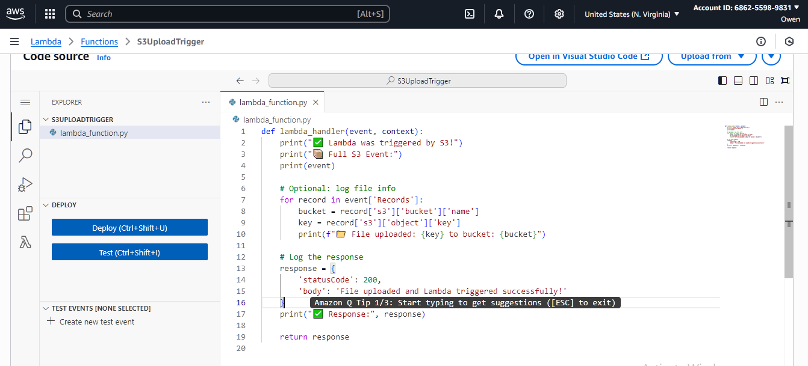
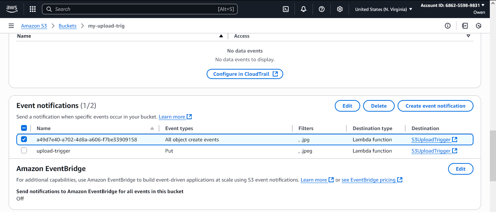

# 📦 S3-to-Lambda Trigger Setup

## 📝 Description

Create an S3 bucket that will automatically trigger a Lambda function whenever a new file is uploaded to the bucket.

---

## ✅ Deliverables

- [x] S3 bucket with event trigger connected to Lambda function  
- [x] Screenshot of Lambda function code/settings (add your image below)

---

## 🚀 Steps to Trigger a Lambda Function from an S3 Bucket Upload or Delete Event

### ✅ STEP 1: Create an S3 Bucket

1. Go to the **AWS Management Console**
2. Navigate to **S3** and click **"Create bucket"**
3. Name your bucket (e.g., `my-upload-bucket-123`)
4. Choose a region
5. Leave other settings as default (you can disable public access for security)
6. Click **"Create bucket"**

---

### ✅ STEP 2: Create a Lambda Function

1. Go to **AWS Lambda** in the console
2. Click **"Create function"**
3. Choose **Author from scratch**
4. Name your function (e.g., `s3UploadTriggerFunction`)
5. Runtime: Select **Python 3.12** or **Node.js 20.x** (I used Python)
6. Under **Permissions**, choose:
   - `Create a new role with basic Lambda permissions`
7. Click **"Create function"**

> 📝 Once created, you’ll see the inline code editor. Replace the default code with your Lambda logic.

---

### ✅ STEP 3: Add an S3 Trigger to Your Lambda Function

1. Go to your function's **Configuration** tab or click on **"Add trigger"** from the **Overview** tab
2. Select **S3** as the trigger type
3. Choose the bucket you created earlier
4. Select an **Event type**:
   - `All object create events` (for uploads)
   - `All object delete events` (for deletes)
5. Acknowledge the **Recursive invocation warning**
6. Click **Add**

> ✅ This will automatically create an **event notification** on your S3 bucket behind the scenes.

---

### ✅ STEP 4: Test It!

1. Go to your **S3 bucket**
2. Click **"Upload"** and add a test file (e.g., `hello.txt`)
3. Go to **CloudWatch Logs**
4. Find your Lambda function’s log group
5. Open the latest log stream — you should see the **event details**, including bucket name, object key, and event type

---

## 📸 Screenshots

- Lambda Code
* 

- CloudWatch logs
* 

- S3 Event Notification
* 