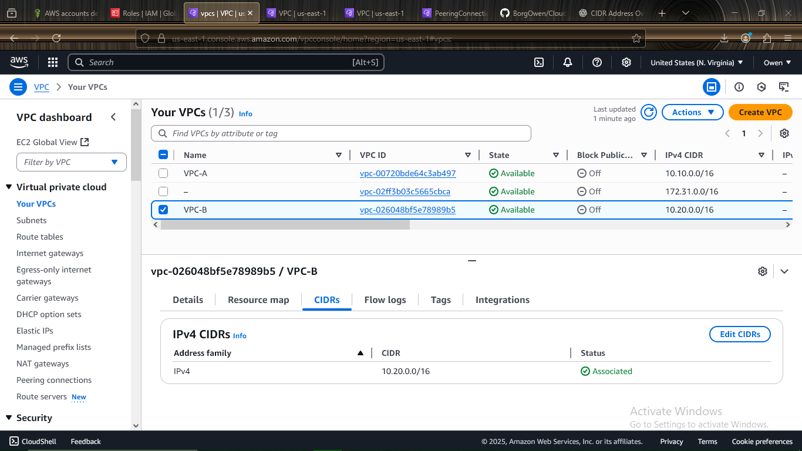
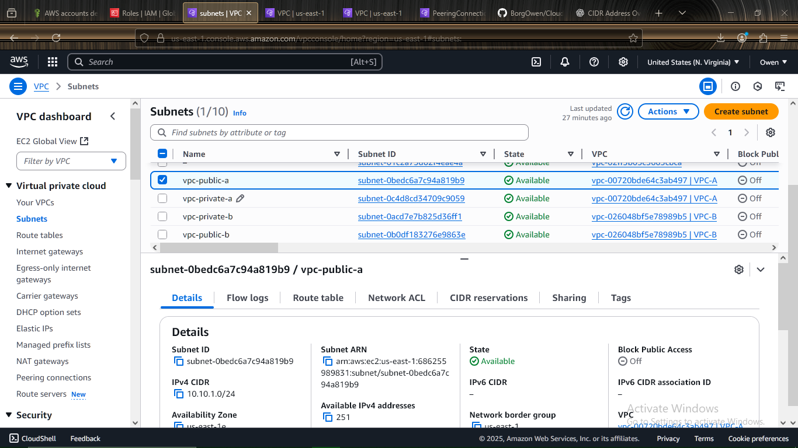
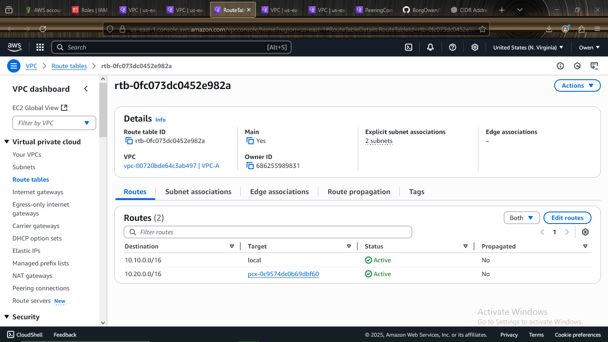
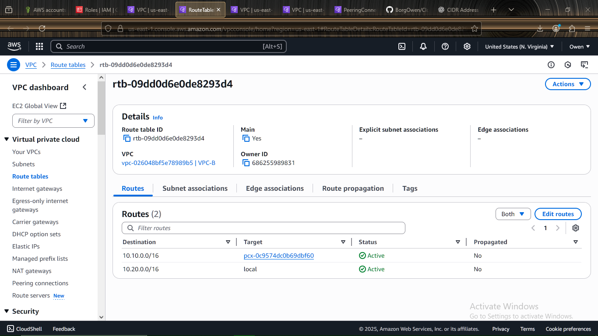

---

```md
# 🌐 Multi-VPC Architecture on AWS

## 📝 Description

This project demonstrates how to set up a **multi-VPC architecture** by creating two separate **VPCs** in AWS.  
Each VPC will have its own **public** and **private subnets**, and the two VPCs will be connected using a **VPC Peering Connection**.  
The peering connection enables traffic between the VPCs, and route tables are configured accordingly.

---

## 🎯 Deliverables

Include screenshots showing:

- ✅ Two VPCs and their **CIDR blocks**  
- ✅ Public and Private **subnets** in each VPC  
- ✅ Active **VPC Peering Connection**  
- ✅ Route tables updated with routes to the other VPC via peering  

---

## 🚀 Steps to Deploy

### ✅ STEP 1: Create Two VPCs

1. Go to **VPC Dashboard** → Click **“Create VPC”**
2. Create `VPC-A`:
   - Name: `VPC-A`
   - CIDR: `10.0.0.0/16`
3. Create `VPC-B`:
   - Name: `VPC-B`
   - CIDR: `192.168.0.0/16`

---

### ✅ STEP 2: Create Subnets

For each VPC:

- **Public Subnet** (e.g., `10.0.1.0/24` in VPC-A)
- **Private Subnet** (e.g., `10.0.2.0/24` in VPC-A)
- Ensure subnets are in **different availability zones** for HA

---

### ✅ STEP 3: Create VPC Peering Connection

1. Go to **VPC Dashboard** → **Peering Connections**
2. Click **“Create Peering Connection”**
3. Select:
   - **Requester VPC**: `VPC-A`
   - **Accepter VPC**: `VPC-B` (choose from your account)
4. Click **Create Peering Connection**
5. After creation, **Accept** the peering request from the `VPC-B` side

---

### ✅ STEP 4: Update Route Tables

1. For **VPC-A**:
   - Edit **Route Table** for public and/or private subnet
   - Add route:
     - Destination: `192.168.0.0/16`
     - Target: Peering Connection ID (e.g., `pcx-abc123`)

2. For **VPC-B**:
   - Edit **Route Table** similarly
   - Add route:
     - Destination: `10.0.0.0/16`
     - Target: same Peering Connection

---

## 📸 Screenshots to Include

- 🗺️ VPC List  
  

- 🌐 Subnet List  
  

- 🔗 Peering Connection Status  
  

- 🛣️ Route Tables with Peering  
  
  

---

```