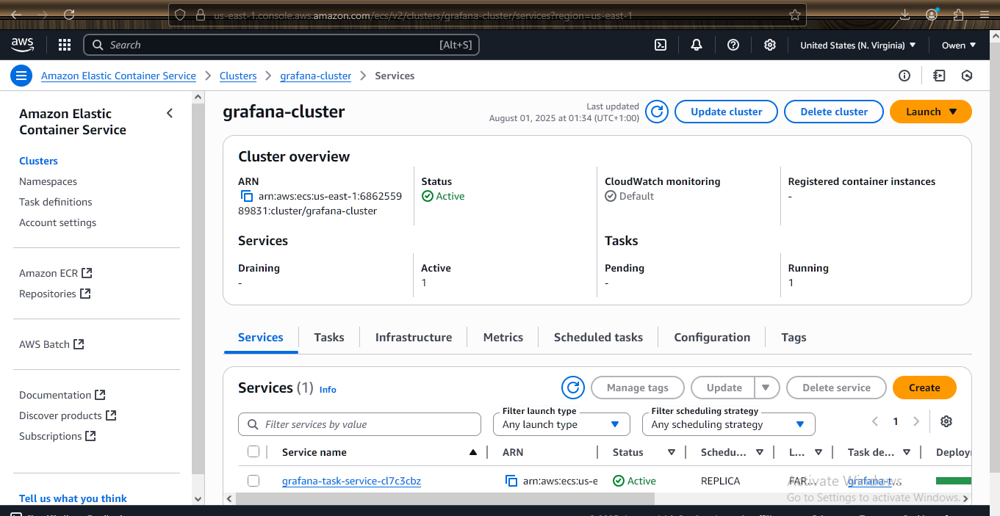
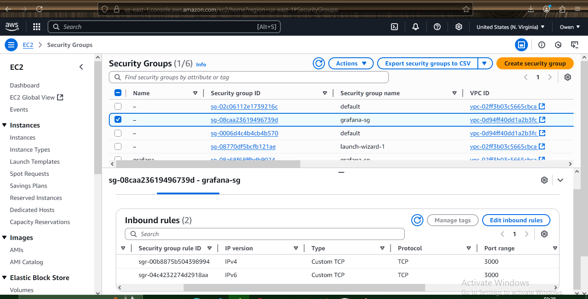
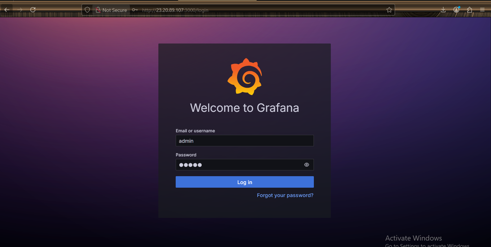

---

# 📊 Deploy Grafana on Amazon ECS Using Fargate

## 📝 Description

This project involves deploying the official **`grafana/grafana`** Docker image on **Amazon ECS** using the **Fargate** launch type.  
AWS Fargate lets you run containers without managing EC2 instances. Grafana will be publicly accessible on **port 3000**, the default port for its web UI.

---

## 🎯 Deliverables

- ✅ ECS Cluster with a running Grafana service  
- ✅ ECS Task Definition using the `grafana/grafana` Docker image  
- ✅ Security Group allowing **port 3000** inbound traffic  
- ✅ Screenshot of **Grafana login page** loaded in a web browser  

---

## 🚀 Deployment Steps

### ✅ STEP 1: Create an ECS Cluster

1. Go to **Amazon ECS** in the AWS Console  
2. Click **“Create Cluster”**
3. Choose **“Networking only (Fargate)”**
4. Name the cluster (e.g., `grafana-cluster`) and click **Create**

---

### ✅ STEP 2: Create a Task Definition

1. Go to **Task Definitions** → Click **Create new Task Definition**
2. Choose **Fargate**
3. Under **Task and container definitions**:
   - **Task Role**: Leave default or create one with CloudWatch permissions
   - **Task Size**: e.g., `512 MiB` memory, `0.25 vCPU`
   - **Add Container**:
     - **Name**: `grafana`
     - **Image**: `grafana/grafana`
     - **Port mappings**: `3000` (TCP)
4. Click **Create**

---

### ✅ STEP 3: Create a Security Group for Grafana

1. Go to **VPC → Security Groups**
2. Create a new security group or modify an existing one
3. Add an **Inbound Rule**:
   - **Type**: Custom TCP
   - **Port**: `3000`
   - **Source**: `0.0.0.0/0` (or your IP for restricted access)

---

### ✅ STEP 4: Run the Task as a Service

1. Go to your **ECS Cluster**
2. Click **“Create” → Service**
3. Choose:
   - **Launch type**: Fargate
   - **Task Definition**: Select the one with `grafana/grafana`
   - **Platform version**: Latest
   - **Cluster**: `grafana-cluster`
   - **Service name**: `grafana-service`
   - **Number of tasks**: `1`
4. Configure Networking:
   - Choose a **public subnet**
   - Enable **Auto-assign public IP**
   - Attach the **security group** that allows port 3000
5. Click **Create Service**

---

### ✅ STEP 5: Access Grafana in Browser

1. Once the task is running, go to the **ECS task details**
2. Copy the **Public IP** from the **ENI** (Elastic Network Interface)
3. Open in browser:  
   `http://<PUBLIC-IP>:3000`
4. You should see the **Grafana login page**

---

## 📸 Screenshots

- ECS Cluster and Running Service 
- 

- ECS Task Definition
- 

- Security Group showing port 3000 access
- 

- Grafana Login Page in Browser 
- 

---