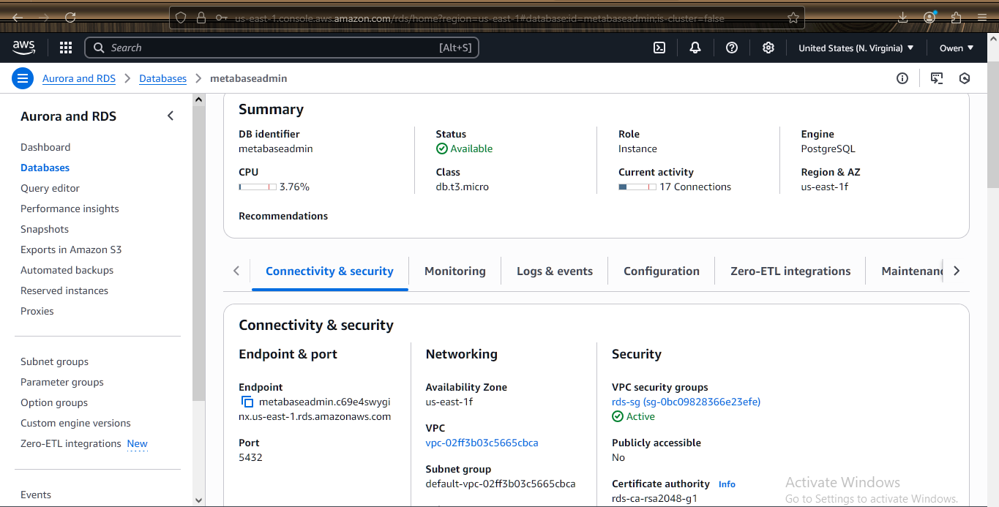

---
# 📊 Deploy Metabase on Amazon ECS with PostgreSQL RDS

## 📝 Description

Deploy **Metabase** on **Amazon ECS** using the **Fargate** launch type and connect it to a **PostgreSQL** database hosted on **Amazon RDS**.

This setup allows Metabase to persist configurations and query data from the RDS instance, enabling a robust and scalable BI dashboard solution.

---

## ✅ Deliverables

- [x] Screenshot of **RDS PostgreSQL** instance details  
- [x] Screenshot of **ECS task definition** and running service  
- [x] Screenshot of **security group rules** allowing ECS → RDS on port `5432`  
- [x] Screenshot of **Metabase UI** showing successful connection to the database  

---

## 🚀 Deployment Steps

---

### ✅ STEP 1: Launch PostgreSQL on RDS

1. Go to **Amazon RDS** → Click **Create database**
2. Choose:
   - Engine: **PostgreSQL**
   - Templates: **Free tier** (or as needed)
3. DB Settings:
   - DB instance identifier: `metabase-db`
   - Master username: `admin`
   - Master password: `your-secure-password`
4. Connectivity:
   - VPC: Select existing or create new
   - Public access: **No**
   - VPC Security group: Create or use one that allows port `5432` from ECS
5. Storage: Leave defaults or adjust as needed
6. Click **Create database**

⚠️ **Important**: Note the RDS **endpoint**, **port (5432)**, **username**, and **DB name**

---

### ✅ STEP 2: Create Security Group Rules

1. Go to **EC2** → **Security Groups**
2. Select the **RDS security group**
3. Add an **Inbound Rule**:
   - Type: **PostgreSQL**
   - Port: `5432`
   - Source: Security group of your **ECS tasks** (not public IP)

4. Ensure the ECS security group allows **outbound traffic**

---

### ✅ STEP 3: Create ECS Task Definition

1. Go to **ECS** → **Task Definitions** → **Create new task definition**
   - Launch Type: **Fargate**
2. Task details:
   - Name: `metabase-task`
   - Task Role: `ecsTaskExecutionRole`
   - CPU: e.g., `512`
   - Memory: e.g., `1024`

3. Add container:
   - Name: `metabase`
   - Image: `metabase/metabase:latest`
   - Port mappings: `3000`

4. Add **environment variables**:
   - `MB_DB_TYPE=postgres`
   - `MB_DB_DBNAME=your_db_name`
   - `MB_DB_PORT=5432`
   - `MB_DB_USER=admin`
   - `MB_DB_PASS=your-secure-password`
   - `MB_DB_HOST=<your-rds-endpoint>`

5. Click **Create**

---

### ✅ STEP 4: Deploy Service on ECS Cluster

1. Create or select a **Fargate cluster**
2. Click **Create Service**
   - Launch Type: `Fargate`
   - Task Definition: select `metabase-task`
   - Cluster: `metabase-cluster`
   - Service name: `metabase-service`
   - Number of tasks: `1`
   - Public IP: **ENABLED**
   - Subnets: Select public subnets
   - Security group: Allow inbound on port `3000` (HTTP)

3. Click **Create service**  
   Metabase will be deployed and accessible via the assigned **public IP**

---

### ✅ STEP 5: Access Metabase UI and Connect to RDS

1. Go to the **running task** → Get the **public IP**
2. Open `http://<public-ip>:3000` in your browser
3. Walk through the Metabase setup:
   - Create admin user
   - Connect to your **PostgreSQL RDS** using the same credentials and endpoint

4. Once connected, Metabase will show a success message and dashboard UI

---

## 📸 Screenshots

> 📁 Add screenshots here for documentation or submission:

- 
- 
- 
- 
- 

---

## 💡 Tips

- If Metabase fails to connect, double-check:
  - RDS is in the same VPC as ECS
  - Security groups allow ECS → RDS on port `5432`
  - The RDS endpoint and credentials are correct
- Metabase stores its metadata (users, dashboards, configs) in this connected DB, so ensure it's persistent and backed up

---
