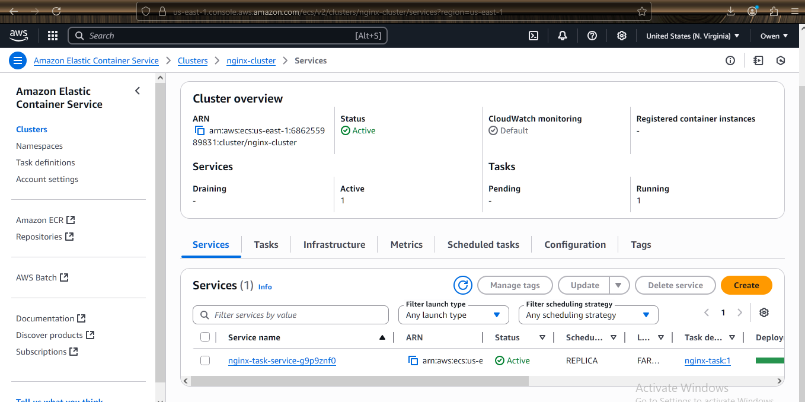
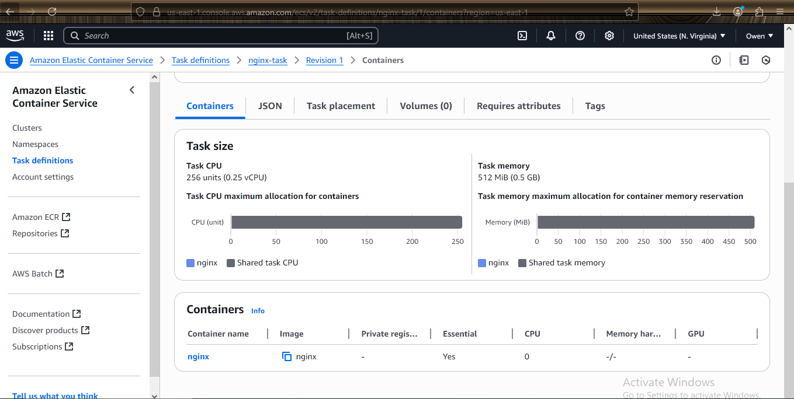
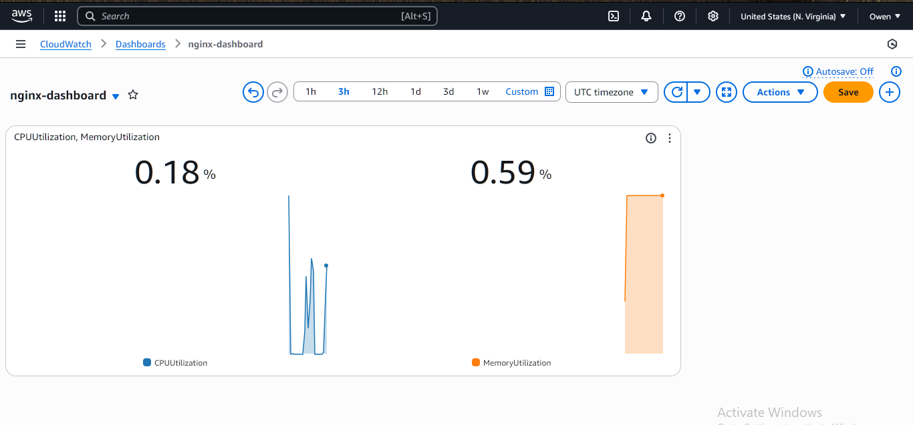

---

````markdown
# 🚀 Deploying NGINX on Amazon ECS with CloudWatch Monitoring

## 📝 Description

Deploy an NGINX web server on **Amazon ECS** using **Fargate** in a **public subnet**.  
Monitor the ECS task in real-time using a **CloudWatch dashboard** that includes widgets for:
- `CPUUtilization`
- `MemoryUtilization`

To simulate real-world behavior, apply **load testing** using tools like `curl`, `ab`, or `hey` and observe the impact on metrics via CloudWatch.

---

## ✅ Deliverables

- [x] Screenshot of ECS cluster and running service
- [x] Screenshot of ECS task definition with specified CPU and memory settings
- [x] Screenshot of CloudWatch dashboard with CPU and memory widgets
- [x] Screenshot showing metric changes under simulated load

---

## 📦 Steps to Deploy NGINX on ECS (Fargate) with CloudWatch Monitoring

---

### ✅ STEP 1: Create ECS Task Definition

1. Go to **Amazon ECS** → **Task Definitions**
2. Click **Create new Task Definition** → Choose **FARGATE**
3. Fill in:
   - **Task name**: `nginx-fargate-task`
   - **Task role**: `ecsTaskExecutionRole` (create one if it doesn't exist)
   - **CPU**: e.g., `256 (.25 vCPU)`
   - **Memory**: e.g., `512 (MiB)`
4. Add container:
   - **Name**: `nginx-container`
   - **Image**: `nginx:latest`
   - **Port mappings**: `80`

5. Click **Create**

---

### ✅ STEP 2: Create ECS Cluster and Service

1. Go to **Clusters** → Click **Create Cluster**
   - Select **Networking only (Fargate)**
   - Name: `nginx-cluster`

2. After creating the cluster, click **Create service**
   - Launch type: `FARGATE`
   - Task Definition: choose the one from Step 1
   - Cluster: `nginx-cluster`
   - Service name: `nginx-service`
   - Number of tasks: `1`
   - Cluster VPC: select a VPC with public subnets
   - Assign a public IP: **ENABLED**

3. Click **Create service** → ECS will pull the image and run your container

---

### ✅ STEP 3: Access NGINX in Browser

1. Go to the **Tasks tab** inside your ECS cluster
2. Click the running task → scroll down to **ENI public IP**
3. Copy the public IP and paste in your browser → You should see the default **NGINX welcome page**

---

### ✅ STEP 4: Create CloudWatch Dashboard

1. Go to **Amazon CloudWatch** → Dashboards → **Create dashboard**
2. Name: `nginx-ecs-monitoring`
3. Add widgets:
   - **CPU Utilization**
     - Choose **ECS → Per-Task Metrics**
     - Metric: `CPUUtilization`
   - **Memory Utilization**
     - Choose **ECS → Per-Task Metrics**
     - Metric: `MemoryUtilization`

4. Save the dashboard

---

### ✅ STEP 5: Simulate Load (Optional but Recommended)

1. Open a terminal and run a stress test:
   ```bash
   ab -n 1000 -c 100 http://<your-ecs-public-ip>/
````

or

```bash
while true; do curl http://<your-ecs-public-ip>/; done
```

2. Refresh your **CloudWatch dashboard** to see real-time updates in CPU and memory usage

---

## 📸 Screenshots

> 📁 Add screenshots below for documentation and grading:

* 
* 
* 
* 

---

## 💡 Tips

* If metrics don’t show up immediately, wait a few minutes or verify IAM roles are properly assigned (e.g., `CloudWatchLogsFullAccess`)
* Use `nginx:alpine` for a smaller and faster image
* You can also automate this using **Terraform** or **CloudFormation**

---

