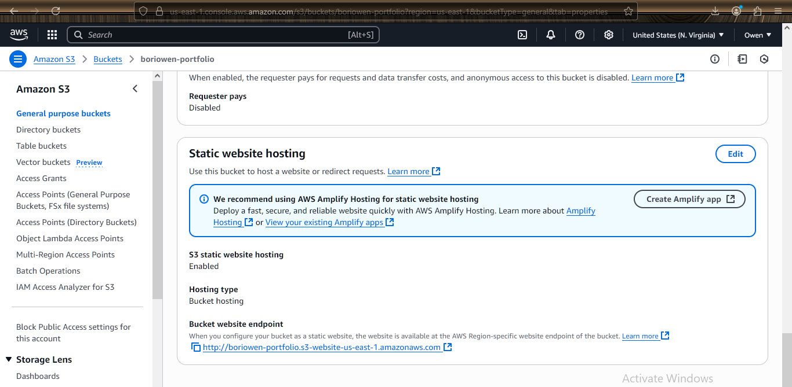

---

# 🌐 Personal Static Website Hosting with S3 + CloudFront

## 📝 Description

Deploy a personal static website such as a resume, portfolio, or about-me page using **Amazon S3 and CloudFront**.  
Your HTML (and optional CSS/JS) files will be uploaded to the S3 bucket.  
- **Static website hosting** should be enabled.  
- The bucket should be **configured for public access**.  
- A **CloudFront distribution** will use the S3 bucket as its **origin**, delivering your website content securely over HTTPS.

---

## ✅ Deliverables

- [x] Screenshot of S3 bucket configuration showing:
  - Static website hosting enabled
  - Public access bucket policy
- [x] Screenshot of CloudFront distribution settings and deployment status
- [x] Screenshot of live website accessed via CloudFront domain

---

## 🚀 Steps to Deploy a Static Website Using S3 + CloudFront

### ✅ STEP 1: Prepare Your Website Files

1. Create a simple static website folder on your computer (e.g., `index.html`, `style.css`)
2. Test it locally in your browser to make sure it works
3. Zip or organize the files for easy upload to S3

---

### ✅ STEP 2: Create and Configure the S3 Bucket

1. Go to the **AWS Management Console**
2. Navigate to **S3** → click **"Create bucket"**
3. Name your bucket (e.g., `my-portfolio-website`)
4. Choose a region
5. **Uncheck "Block all public access"** (important for public hosting)
6. Leave other settings as default → click **"Create bucket"**

---

### ✅ STEP 3: Enable Static Website Hosting

1. Go to your S3 bucket → **Properties tab**
2. Scroll down to **"Static website hosting"**
3. Choose **"Enable"**
4. Enter `index.html` for the index document (and optionally `error.html`)
5. Click **Save**

---

### ✅ STEP 4: Upload Website Files

1. Go to the **Objects tab**
2. Click **"Upload"** → add all your static files (HTML, CSS, images, etc.)
3. Click **Upload**

---

### ✅ STEP 5: Add a Public Bucket Policy

1. Go to the **Permissions tab**
2. Scroll to **Bucket policy** and paste the following:

```json
{
  "Version": "2012-10-17",
  "Statement": [
    {
      "Sid": "PublicReadGetObject",
      "Effect": "Allow",
      "Principal": "*",
      "Action": "s3:GetObject",
      "Resource": "arn:aws:s3:::my-portfolio-website/*"
    }
  ]
}
````

> Replace `my-portfolio-website` with your actual bucket name.

---

### ✅ STEP 6: Set Up a CloudFront Distribution

1. Go to **CloudFront** → Click **“Create distribution”**
2. Under **Origin domain**, select your **S3 bucket website endpoint**

   * Do **not** select the auto-complete option with `.s3.amazonaws.com`, scroll down and use the full endpoint like:
     `my-portfolio-website.s3-website-us-east-1.amazonaws.com`
3. Leave defaults or:

   * **Viewer protocol policy**: Redirect HTTP to HTTPS
   * **Default root object**: `index.html`
4. Click **Create distribution**

---

### ✅ STEP 7: Test Your Live Website

1. Wait for the CloudFront distribution to finish deploying (status: **“Deployed”**)
2. Copy the **CloudFront domain name** (e.g., `d12345678abcde.cloudfront.net`)
3. Paste it into your browser

> 🎉 Your static site is now live and served securely via CloudFront!

---

## 📸 Screenshots

> 📁 Add your screenshots below (drag and drop or use Markdown image tags):

* 
* 
* 
* 


---
